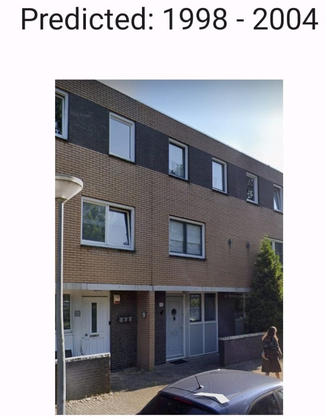
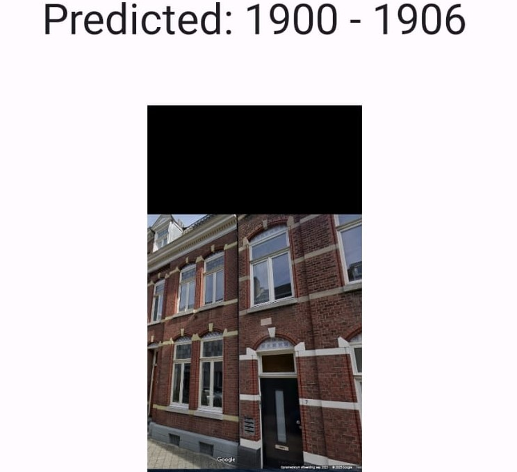
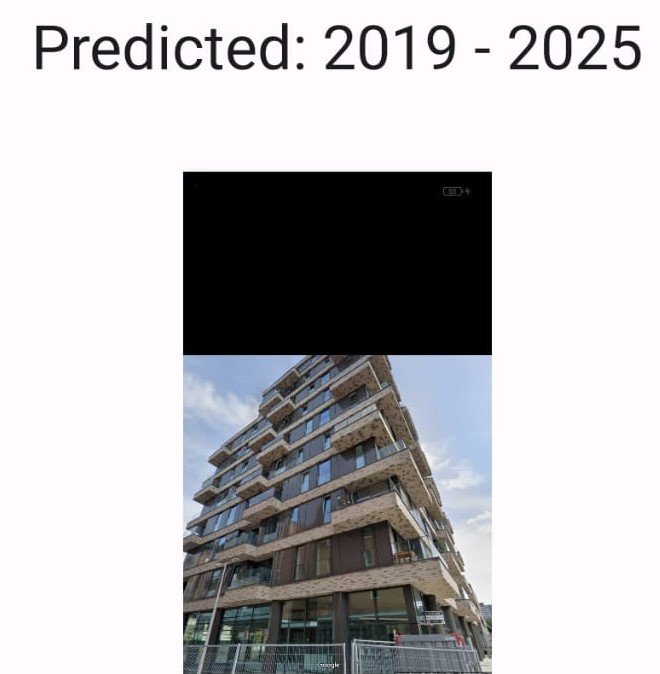

# Dutch House Construction Year Prediction with Transfer Learning (EfficientNetB0)

This project uses transfer learning with an EfficientNetB0 model to predict the construction year of houses in the Netherlands based on Google Street View images.

---

## Project Overview

### Objective

The goal of this project is to estimate the construction year of Dutch homes using visual features from exterior images retrieved through Google Maps.

### Dataset

- **Source**: The DAG-register (Datasets Achtergrondgegevens Gebouwen), an open dataset that contains:
  - Geographic coordinates of all buildings in the Netherlands
  - Official construction years
- **Sampling**:
  - 25,000 buildings were randomly selected
  - Google Street View images were collected for each using the Google Maps API

### Camera Orientation

To ensure that each house is clearly visible in the image:
- The Street View camera heading was computed based on the angle between the building's coordinates and the closest available Street View location
- This method aimed to frame the front of each house as accurately as possible

---

## Model Architecture

- EfficientNetB0 was used with pretrained ImageNet weights
- The top four layers were unfrozen for fine-tuning
- The output layer classifies into 13 decade-based bins, such as 1900–1909, 1910–1919, ..., 2020–2029

---

## Results

- Accuracy for exact bin prediction: approximately 40%
- Total number of bins: 13
- A random guess would result in about 7.7% accuracy
- Most errors were within one bin of the correct decade

Given the subtle differences between houses built in different decades, this is a fairly strong performance.

---

## Prediction Examples

